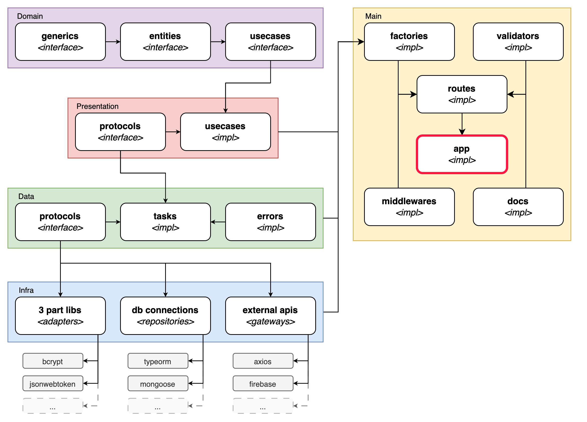
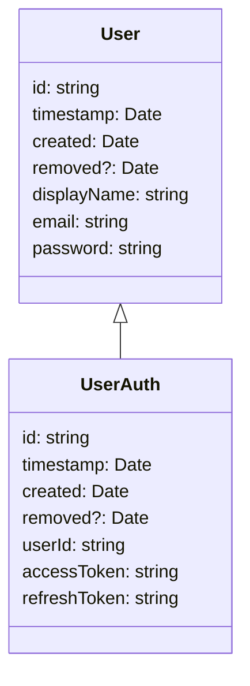

 
 
 


# example-auth-api

Proposta de reformulação da api-auth-caas utilizando os princípios do Clean Code e SOLID sem restringir a utilização de bibliotecas que auxiliam no desenvolvimento. 

Abaixo estarão descritos as principais mudanças do projeto:

## Separação das camadas arquiteturais

A separação de camadas da aplicação permite uma melhor organização do projeto, facilitando a manutenção, reduzindo o acoplamento entre camadas e para outras bibliotecas.

Abaixo mostra um diagrama arquitetural da aplicação e suas responsabilidades:

<div class="center">



</div>

- <u>domain</u>: define as assinaturas que representam os casos de usos e suas entidades, além de manter também outros tipos comuns que são utilizados para complementar os casos de uso
- <u>presentation</u>: implementa os casos de uso, definindo também os as assinaturas das ações executadas pelo caso de uso caso de uso
- <u>data</u>: implementa as ações executadas pelo caso de uso, definindo as assinaturas que são implementadas por bibliotecas de terceiros ou por integrações com outras soluções
- <u>infra</u>: implementa as assinaturas da camada de dados, modularizando cada biblioteca de terceiro e mantendo seu escopo fechado
- <u>main</u>: conecta todas as camadas, implementando também a validação de entrada dos casos de uso, os middlewares e as rotas da aplicação

## Normalização de artefatos

Ao trabalhar com Typescript, deve-se respeitar as convensões definidas pela linguagem para nomenclaturas sendo:

- Aconselha-se a utilização de tipos ao invés de interfaces por bloquearem que sejam sobreescritos:

  ```ts
  type Example = {
    foo(): void
  }
  type Example = { // throws error
    bar(): void
  }
  ```

- Classes devem iniciar com letra maiúscula. Ex:

  ```ts
  class ExampleImpl implements Example {
  }
  ```

- Constantes devem utilizar o formato "snake_case" com todas as letras maiúsculas. Ex:

  ```ts
  const TABLE_EXAMPLE = 'example';
  ```

- Propriedades e métodos de classes, variáveis de código e funções devem respeitar o formato "camelCase". Ex:

  ```ts
  function exampleFn() {
  }
  class ExampleImpl implements Example {
    public example: string
    public getExample(): string {
      const example = exampleFn() + this.example
    }
  }
  ```

- Classes devem receber todas as suas dependências a partir de seu construtor exceto aquelas que funcionam como adapters na camada de infraestrutura. Além disso todas as propriedades recebidas devem ser declaradas como `private readonly`. Ex:

  ```ts
  class ExampleImpl implements Example {
    constructor(
      private readonly exampleRepository: ExampleRepository
    ){ }
  }    
  ```

- Variáveis de ambiente devem ser centralizadas em um arquivo de acesso global no projeto, mantendo valores padrão e corrigindo os tipos esperados. Ex:

  ```ts
  // ./src/vars.ts
  import packageJson from 'package.json';

  const { env, cwd } = process;

  const vars = {
    path: cwd(),
    port: Number(env.PORT ?? 3000),
    app: {
      name: packageJson.name,
      version: packageJson.version,
      env: env.NODE_ENV ?? 'development'
    }
  } as const;

  export default vars;
  ```

- Para definir os tipos dos parâmetros e retornos de uma interface, é aconselhável a utilização de namespaces pois possibilitam encapsular subtipos nos mesmos tipos. Ex:

  ```ts
  export type GetExampleUseCase = {
    get(id: GetExampleUseCase.Id): Promise<GetExampleUseCase.Result>
  }
  export namespace GetExampleUseCase {
    export type Id = Example['id']
    export type Result = Example
  }
  ```

- Métodos ou funções com 2 ou mais argumentos devem receber um objeto e não argumentos encadeados. Ao fazer isso possibilita a passagem de valores opcionais além de aumentar a legibilidade do código em relação a quais parâmetros estão sendo definidos. Ex:

  ```ts
  export type EditExampleUseCase = {
    get(args: EditExampleUseCase.Args): Promise<EditExampleUseCase.Result>
  }
  export namespace EditExampleUseCase {
    export type Args = {
      id: number,
      changes: Partial<Omit<Example, 'id'>>
    }
    export type Result = Example
  }
  ```

- Métodos ou funções devem atribuir o resultado a uma constante antes de fazer o retorno. Isso garante que aquela função/método possa ser debugável sem que seja necessário fazer a alteração do código. Ex:

  ```ts
  // infra layer
  import mysql from 'mysql2/promise';
  const db = mysql.createPool({ ... });

  const fieldMap = {
    id: 'id',
    displayName: 'display_name',
    email: 'email',
    password: 'password',
    photoURL: 'photo_url'
  };

  class GetUserRepositoryImpl implements GetUserRepository {
    get(id: GetUserRepository.Id): Promise<GetUserRepository.Result> {
      const fields = Object
        .entries(fieldMap)
        .map(([key, value]) => `${key} AS ${value}`)
        .join()
      const sql = `SELECT ${fields} FROM example WHERE id = ?`;
      const [[row]] = await db.query(sql, [id]);
      return row;
    }
  }
  // data layer
  class GetUserTaskImpl implements GetUserTask {
    constructor(
      private readonly getUserRepository: GetUserRepository
    ) {}

    get(id: GetUserTask.Id): Promise<GetUserTask.Result> {
      const user = await this.getUserRepository.get(id);
      return user; // a regra se aplica aqui.
    }
  }
  ```

- Métodos e funções devem ter somente um tipo de retorno. Caso haja a necessidade de haver 2 tipos distintos, deve-se retornar um objeto com as propriedades de retorno definidas. Ex:

  ```ts
  function exampleFn(): string | number {} // errado
  function exampleFn(): { strValue: string, numValue: number }
  ```

  Além disso quando os retornos não tiverem um resultado, espera-se que o retorno seja `undefined`. Isso porque ele:
  
  - Pode ser utilizado para validações do tipo "falsy/truthy":
     ```ts
     const value = undefined;
     console.log(!value);  // true
     console.log(!!value); // false
     ```
  - Permite a utilização da sintaxe "Spread" para fazer a união de 2 ou mais objetos:
     ```ts
     const emptyObj = undefined;
     const nullObj = null
     const validObj = { a: 1 };
     console.log({...validObj, ...emptyObj}) // returns { a: 1 }
     ```
  - Dispara erros ao tentar ser feito o `JSON.parse()` para manter a consistência do fluxo de execução:
     ```ts
     JSON.parse(undefined);
     // Uncaught SyntaxError: "undefined" is not valid JSON
     ```
  - Funciona como valor inicial para qualquer tipo:
     ```ts
     let strValue: string;  console.log(strValue) // undefined
     let numValue: number;  console.log(numValue) // undefined
     let bolValue: boolean; console.log(bolValue) // undefined
     let objValue: Date;    console.log(objValue) // undefined
     ```
  - Ao ser utilizado como valor em alguma propriedade em um objeto faz com que o `JSON.stringify()` ignore aquela propriedade, reduzindo o tamanho dos dados trafegados.
     > **Nota**: é interessante que propriedades opcionais não apareçam em objetos de retorno pois a utilização do `null` implica que a propriedade é obrigatória mesmo tendo um valor nulo.

- A nomenclatura de artefatos, métodos e funções devem ser definidos no singular para evitar anomalias nominais de linguagem. Ex:

  ```ts
  type Address {}
  async function getAddresses(): Promise<Address[]> {} // errado
  async function listAddress(): Promise<Address[]> {} // certo
  ```

  Também é interessante que variáveis que representem listas, que começem com as terminologias `list{{Entity}}` ou `arr{{Entity}}`

- Propriedades de entidades que representem ligações com outras entidades devem levar como padrão o nome da entidade representada seguida da propriedade de ligação. Ex: 

  ```ts
  type User = {
   id: string
   email: string
   password: string
  }
  type UserLogin = {
   id: string
   userId: User['id']
  }
  ```
 
  É importante que esse padrão também seja seguido na definição de tabelas ou coleções em bancos de dados. Ex:

  ```sql
  CREATE TABLE `user` (
    `id` UUID NOT NULL PRIMARY KEY,
    `email` VARCHAR(100) NOT NULL UNIQUE,
    `password` TEXT NOT NULL
  );
  CREATE TABLE `user_login` (
    `id` UUID NOT NULL PRIMARY KEY,
    `user_id` UUID NOT NULL REFERENCES `user` (`id`)
  );
  ```

- Em bancos de dados, para representa uma tabela de ligação de duas ou mais tabelas, esta deve receber como nomenclatura os nomes das tabelas mantendo 2 underlines entre os nomes. Ex:

  ```sql
  CREATE TABLE `user` (
    `id` UUID NOT NULL PRIMARY KEY
  );
  CREATE TABLE `permission` (
    `id` UUID NOT NULL PRIMARY KEY
  );
  CREATE TABLE `user__permission` (
    `user_id` UUID NOT NULL REFERENCES `user` (`id`),
    `permission_id` UUID NOT NULL REFERENCES `permission` (`id`),
    PRIMARY KEY (`user_id`, `permission_id`)
  )
  ```

- Arquivos devem utilizar somente letras minúsculas, separando palavras com um traço. Isso é importante pois dependendo do sistema operacional podem ocorrer erros de indexação do git ao trocar apenas o case de alguma letra de algum arquivo. Ex: `exampleRepository.ts ~> ExampleRepository.ts`

## Definição de testes

Todos os testes que são feitos nas camadas <u>presentation</u>, <u>data</u> e <u>infra</u> são testes unitários, ou seja, deve-se testar somente os fluxos existentes em cada teste, fazendo o mocking de quaisquer dependência para que a mesma responda como o fluxo esperado ocorra.

Já os testes na camada <u>main</u> são considerados testes de integração pois é a camada que integra todas as outras. Estes testes devem manter o mocking somente dos artefatos não controlados pela solução, como outras api's, filas e bancos de dados.

Para a execução de testes de ponta-a-ponta, é necessário preparar o ambiente em cada teste para que o fluxo definido ocorra. Nesses casos todas as dependências devem ter as mesmas configurações e versões do ambiente de produção para evitar falhas eventuais causadas por versionamento.]

## Definição do banco de dados

Abaixo está o diagrama DER criado para essa solução:

<div class="center">



</div>
